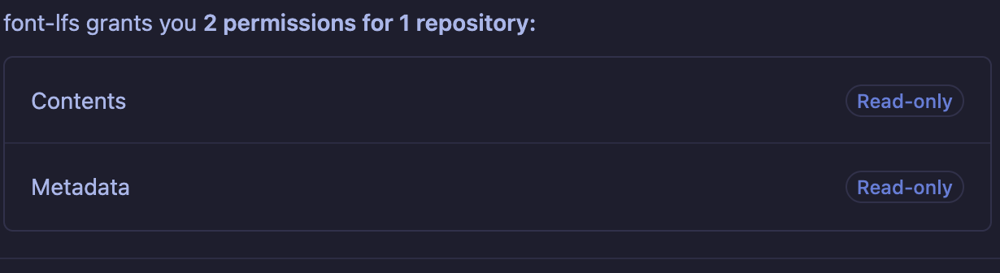

## font

- add private font repo as a git submodule

```bash
git submodule add https://github.com/schnis/repo.git
```

This pins the current HEAD of the remote. This will be used when cloning. To update the head run 

```bash
git submodule aupdate --remote
```

and push

- commit and push

## workflow

- mirror behaviour of [template workflow](.github/workflows/build.yaml)
- add `FONT_REPO_PAT` as a [secret](https://docs.github.com/en/actions/how-tos/write-workflows/choose-what-workflows-do/use-secrets) to the workflow runner
 - needs `repo:read` [permissions](https://docs.github.com/en/authentication/keeping-your-account-and-data-secure/managing-your-personal-access-tokens) on the private lfs repo


